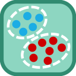
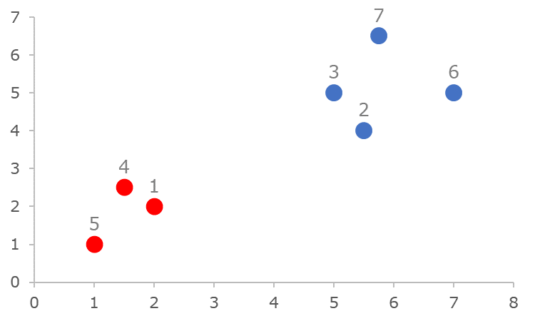
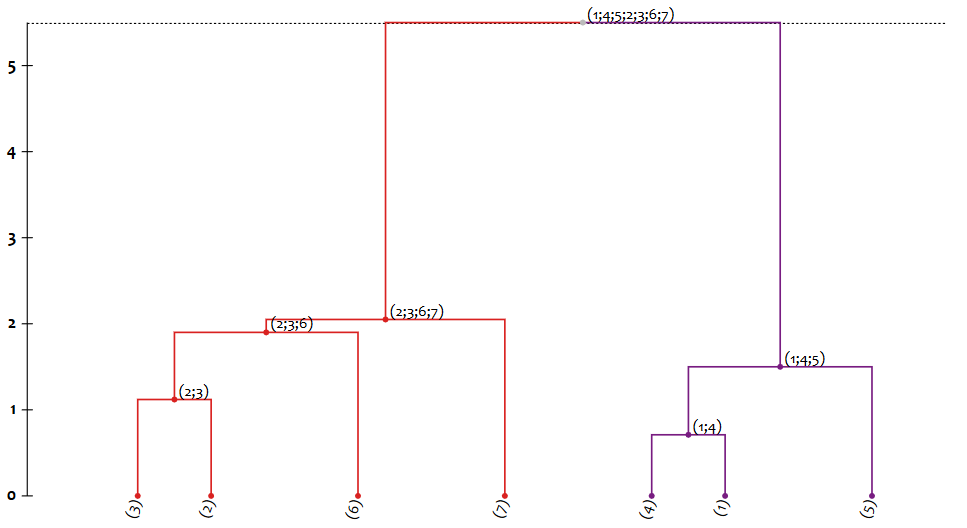

# Aglomera.NET
> A hierarchical agglomerative clustering (HAC) library written in C#

Aglomera is a .NET open-source library written entirely in C# that implements *hierarchical clustering* (HC) algorithms. A *cluster* refers to a *set of instances* or data-points. HC can either be *agglomerative* (bottom-up approach) or *divisive* (top-down approach). The distance between each instance is calculated using some *dissimilarity function*. The distance between clusters is calculated using some *linkage criterion*. Each step of HC produces a new *cluster-set*, *i.e.*, a *set of clusters*, from the cluster-set of the previous step. 

*Agglomerative HC* starts with a cluster-set in which each instance belongs to its own cluster. At each step, it merges the two closest clusters, until all clusters have been merged into a single cluster containing all instances, *i.e.*, it ends with a cluster-set containing a single cluster with all instances. *Divisive HC* works in reverse &mdash; it starts by having a cluster-set with one cluster containing all instances. At each step, it splits clusters recursively, using some *splitting method*, until reaching one cluster-set containing only singletons, *i.e.*, where each instance is placed in its own cluster.

The *clustering result* is a list containing the cluster-set and the corresponding dissimilarity / distance at which it was created at each step of the algorithm. The result is organized in a hierarchical form, *i.e.*, where each cluster references either the *two parents* that were merged for its creation (in the agglomerative approach), or the *two children* resulting from splitting the cluster (in the divisive approach). Due to their hierarchical nature, clustering results can be visualized via a *[dendrogram](https://en.wikipedia.org/wiki/Dendrogram)*.

Currently, Aglomera.NET implements *program AGNES* (AGglomerative NESting) of [Kaufman & Rousseeuw, 1990], *i.e.*, the bottom-up approach, the  It supports different linkage criteria and also provides several metrics to perform internal and external evaluation of clustering results. The results of clustering can be exported to a Json file to be visualized as a dendrogram in *[Dendrogram Viewer](https://github.com/pedrodbs/DendrogramViewer)*, an interactive web-application using D3.js.

**Table of contents**

- [About](#about)
- [API Documentation](#api-documentation)
- [Packages and Dependencies](#packages-and-dependencies)
- [Installation](#installation)
- [Features](#features)
- [Examples](#examples)
- [See Also](#see-also)

------

## About

Aglomera.NET is open-source under the [MIT license](https://github.com/pedrodbs/Aglomera/blob/master/LICENSE.md) and is free for commercial use.

- Source repository: https://github.com/pedrodbs/Aglomera
- Issue tracker: https://github.com/pedrodbs/Aglomera/issues

Supported platforms:

- All runtimes supporting *.NET Standard 1.3+* (*.NET Core 1.0+*, *.NET Framework 4.6+*) on Windows, Linux and Mac

## API Documentation

- [HTML](https://pedrodbs.github.io/Aglomera/)
- [Windows Help file (CHM)](https://github.com/pedrodbs/Aglomera/raw/master/docs/Aglomera.NET.chm)
- [PDF document](https://github.com/pedrodbs/Aglomera/raw/master/docs/Aglomera.NET.pdf)

## Packages and Dependencies

The following packages with the corresponding dependencies are provided:

- **Aglomera:** core package, including clustering algorithm, linkage criteria and evaluation metrics. 
- **Aglomera.D3:** package to export clustering results to Json files to be visualized with D3.js. 
  - [Json.NET](https://www.nuget.org/packages/Newtonsoft.Json/) v11.0.2

## Installation

You can `git clone` the Aglomera.NET [source code](https://github.com/pedrodbs/Aglomera) and use an IDE like VisualStudio to build the corresponding binaries.

## Getting started

Consider the following *data-set* example taken from [Kaufman & Rousseeuw, 1990]:



where colors indicate the "real" instance class, *i.e.*, either 'red' or 'blue'.

Start by defining a *data-point* class, for example one to represent points in a 2D Euclidean space, such as:

```c#
class DataPoint : IComparable<DataPoint>
{
    public DataPoint(string id, double x, double y) { ... }
    public int CompareTo(DataPoint other) { ... }
    ...
}
```
and then define a *dissimilarity metric* for this type:

```c#
class DissimilarityMetric : IDissimilarityMetric<DataPoint>
{
    public double Calculate(DataPoint instance1, DataPoint instance2) { ... }
}
```
We can then define the *data-set* by using:

```c#
var dataPoints = new HashSet<DataPoint>(
    new[]
    {
        new DataPoint("1", 2.00, 2.00),
        new DataPoint("2", 5.50, 4.00),
        new DataPoint("3", 5.00, 5.00),
        new DataPoint("4", 1.50, 2.50),
        new DataPoint("5", 1.00, 1.00),
        new DataPoint("6", 7.00, 5.00),
        new DataPoint("7", 5.75, 6.50)
    });
```

We now select a *linkage criterion* and create the *clustering algorithm*:

```c#
var metric = new DissimilarityMetric();
var linkage = new AverageLinkage<DataPoint>(metric);
var algorithm = new AgglomerativeClusteringAlgorithm<DataPoint>(linkage);
```

The *clustering result* is then obtained by simply executing:

```c#
var clusteringResult = algorithm.GetClustering(dataPoints);
```

Enumerating the result (a `ClusteringResult<DataPoint>` object) yields the following:

```
[0]	{0.000	{(1), (2), (3), (4), (5), (6), (7)}}
[1]	{0.707	{(2), (3), (5), (6), (7), (1;4)}}
[2]	{1.118	{(5), (6), (7), (1;4), (2;3)}}
[3]	{1.498	{(6), (7), (2;3), (1;4;5)}}
[4]	{1.901	{(7), (1;4;5), (2;3;6)}}
[5]	{2.047	{(1;4;5), (2;3;6;7)}}
[6]	{5.496	{(1;4;5;2;3;6;7)}}
```

from which we can select the appropriate data-set, *e.g.*, according to the number of clusters, the distance, external criteria, etc.

## Features

- Supports the following **linkage criteria**, used to consider the dissimilarity between clusters:
  - *Complete* (farthest neighbor), *average* (UPGMA), *centroid*, *minimum energy*, *single* (nearest neighbor), *Ward’s minimum variance* method.
- Provides the following **external clustering evaluation criteria**, used to evaluate the quality of a given cluster-set when each data-point has associated a certain label / class:
  - *Purity*, normalized *mutual information*, *accuracy*, *precision*, *recall*, *F-measure*.

  - To externally-evaluate the clustering result, start by indicating the *class* of each data-point, *e.g.*, a `char`, and an evaluation criterion:

    ```c#
    var pointClasses = new Dictionary<DataPoint, char>{...};
    var criterion = new NormalizedMutualInformation<DataPoint, char>();
    ```

    The evaluation score of the 5th cluster-set is given by executing:

    ```c#
    var score = criterion.Evaluate(clusteringResult[5], pointClasses);
    ```
- Provides the following **internal clustering evaluation criteria**, used to select the optimal number of clusters when *no ground truth is available*:
  - *Silhouette* coefficient, *Dunn* index, *Davies-Bouldin* index, *Calinski-Harabasz* index, *Modified Gamma* statistic, *Xie-Beni* index, *within-between* ratio, *I-index*, *Xu* index, *RMSSD*, *R-squared*.

  - To internally-evaluate the clustering result, we simply choose an evaluation criterion and calculate the score:

    ```c#
    var criterion = new SilhouetteCoefficient<DataPoint>(metric);
    var score = criterion.Evaluate(clusteringResult[5]);
    ```


- **CSV export**


    - To export the result of clustering to a comma-separated values (CSV) file, we simply do:
    
      ```
      clusteringResult.SaveToCsv(FILE_PATH);
      ```
    
      which would produce a CSV file with the contents of each cluster in the cluster-set of each step of the algorithm, one instance per line.

- **D3.js export**

  - Export the *result of clustering* to a Json file that contains the hierarchical structure of the clustering procedure that can be loaded into *[Dendrogram Viewer](https://github.com/pedrodbs/DendrogramViewer)* to produce a *dendrogram*, *e.g.*:

    ```c#
    using Aglomera.D3;
    ...
    clusteringResult.SaveD3DendrogramFile(fullPath, formatting: Formatting.Indented);
    ```

    would produce Json text like the following:

    ```json
    {
      "n": "(1;4;5;2;3;6;7)", "d": 5.5,
      "c": [
        { "n": "(2;3;6;7)", "d": 2.05,
          "c": [
            {
              "n": "(2;3;6)", "d": 1.9,
              "c": [
                {
                  "n": "(2;3)", "d": 1.12,
                  "c": [
                    { "n": "(3)", "d": 0.0, "c": [] },
                    { "n": "(2)", "d": 0.0, "c": [] } ] },
                { "n": "(6)", "d": 0.0, "c": [] } ] },
            { "n": "(7)", "d": 0.0, "c": [] } ]
        },
        { "n": "(1;4;5)", "d": 1.5,
          "c": [
            { "n": "(1;4)", "d": 0.71,
              "c": [
                { "n": "(4)", "d": 0.0, "c": [] },
                { "n": "(1)", "d": 0.0, "c": [] } ] },
            { "n": "(5)", "d": 0.0, "c": [] } ]
        } ]
    }
    ```

    where `n` holds the name or id of the cluster, `d` is the dissimilarity / distance at which it was found and created, and `c` contains the list containing the pair of parents or children of the cluster.

  - When loaded in *[Dendrogram Viewer](https://github.com/pedrodbs/DendrogramViewer)*, this would produce the following dendrogram:

    


## Examples

Example code can be found in the [src/Examples](https://github.com/pedrodbs/Aglomera/tree/master/src/Examples) folder in the [repository](https://github.com/pedrodbs/Aglomera). Several open-source data-sets adapted to work with the example applications can be found in [src/Examples/datasets](https://github.com/pedrodbs/Aglomera/tree/master/src/Examples/datasets).

- **NumericClustering:** a simple example of using agglomerative HC to cluster a data-set loaded from an external CSV file. Several linkage criteria are used and clustering results are saved to CSV and D3 Json files.

- **InternalClusteringEvaluation:** shows how to perform evaluation of clustering results using internal criteria. A data-set is loaded from an external CSV file and clustered using agglomerative HC. For each internal criterion, the optimal cluster-set in the clustering result is selected by maximizing the score.

- **ExternalClusteringEvaluation:** shows how to perform evaluation of clustering results using external criteria. A labeled data-set is loaded from an external CSV file and clustered using agglomerative HC. The class of each instance is given by the first character of its id. The score of several external criteria for each cluster-set in the clustering result is then printed to the Console.

- **ClusteringVisualizer:** a *Windows.Forms* application that allows the visualization of clustering of 2D data. It allows the visual comparison between different linkage criteria and the selection of different number of clusters. Each cluster is attributed a different color according to the selected palette. A screenshot of the application is show below:

  

## See Also

**References**

1. Kaufman, L., & Rousseeuw, P. J. (1990). *[Finding groups in data: an introduction to cluster analysis](https://books.google.com/books?hl=en&lr=&id=YeFQHiikNo0C&oi=fnd&pg=PR11&ots=5ApcG5OEwC&sig=Sx5Bhqfaymzg1U9aRQVIFxmqiHY)*. John Wiley & Sons.
2. Szekely, G. J., & Rizzo, M. L. (2005). [Hierarchical clustering via joint between-within distances: Extending Ward's minimum variance method](https://link.springer.com/article/10.1007/s00357-005-0012-9). *Journal of classification*, *22*(2), 151-183. 
3. Rousseeuw, P. J. (1987). [Silhouettes: a graphical aid to the interpretation and validation of cluster analysis](https://doi.org/10.1016/0377-0427(87)90125-7). *Journal of computational and applied mathematics*, *20*, 53-65. 
4. Dunn, J. C. (1973). [A fuzzy relative of the ISODATA process and its use in detecting compact well-separated clusters](https://doi.org/10.1080/01969727308546046). *Journal of Cybernetics*, *3(3)*, 32-57. 
5. Davies, D. L., & Bouldin, D. W. (1979). [A cluster separation measure](https://doi.org/10.1109/TPAMI.1979.4766909). *IEEE transactions on pattern analysis and machine intelligence*, (2), 224-227. 
6. Caliński, T., & Harabasz, J. (1974). [A dendrite method for cluster analysis](https://doi.org/10.1080/03610927408827101). *Communications in Statistics-theory and Methods*, *3*(1), 1-27. 
7. Hubert, L., & Arabie, P. (1985). [Comparing partitions](https://doi.org/10.1007/BF01908075). *Journal of classification*, *2*(1), 193-218. 
8. Zhao, H., Liang, J., & Hu, H. (2006). [Clustering Validity Based on the Improved Hubert\Gamma Statistic and the Separation of Clusters](https://doi.org/10.1109/ICICIC.2006.250). In *First International Conference on Innovative Computing, Information and Control, 2006. ICICIC'06.* (Vol. 2, pp. 539-543). IEEE. 
9. Xie, X. L., & Beni, G. (1991). [A validity measure for fuzzy clustering](https://doi.org/10.1109/34.85677). *IEEE Transactions on pattern analysis and machine intelligence*, *13*(8), 841-847. 
10. Zhao, Q., Xu, M., & Fränti, P. (2009). [Sum-of-squares based cluster validity index and significance analysis](https://doi.org/10.1007/978-3-642-04921-7_32). In *International Conference on Adaptive and Natural Computing Algorithms* (pp. 313-322). Springer, Berlin, Heidelberg. 
11. Maulik, U., & Bandyopadhyay, S. (2002). [Performance evaluation of some clustering algorithms and validity indices](https://doi.org/10.1109/TPAMI.2002.1114856). *IEEE Transactions on Pattern Analysis and Machine Intelligence*, *24*(12), 1650-1654. 
12. Xu, L. (1997). [Bayesian Ying–Yang machine, clustering and number of clusters](https://doi.org/10.1016/S0167-8655(97)00121-9). *Pattern Recognition Letters*, *18*(11-13), 1167-1178. 

**Other links**

- [Hierarchical agglomerative clustering - Stanford NLP Group](https://nlp.stanford.edu/IR-book/html/htmledition/hierarchical-agglomerative-clustering-1.html)
- [Hierarchical clustering (Wikipedia)](https://en.wikipedia.org/wiki/Hierarchical_clustering)
- [Complete linkage criterion (Wikipedia)](https://en.wikipedia.org/wiki/Complete-linkage_clustering)
- [Single linkage criterion (Wikipedia)](https://en.wikipedia.org/wiki/Single-linkage_clustering)
- [Silhouette clustering (Wikipedia)](https://en.wikipedia.org/wiki/Silhouette_(clustering))
- [Dunn index (Wikipedia)](https://en.wikipedia.org/wiki/Dunn_index)
- [Davies-Bouldin index (Wikipedia)](https://en.wikipedia.org/wiki/Davies%E2%80%93Bouldin_index)
- [Dendrogram Viewer](https://github.com/pedrodbs/DendrogramViewer)
- [D3.js](https://d3js.org/)


Copyright &copy; 2018, [Pedro Sequeira](https://github.com/pedrodbs)
